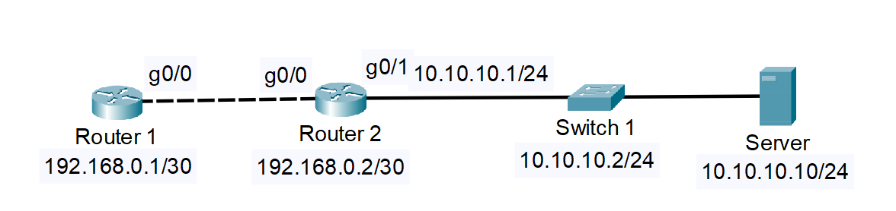

# Configurations

Basic configurations for **Cisco** devices.

If you want to explore another topic [click here](../README.md) to go back.

## Host Route

A **host route** is a route that directs traffic to a **specific IP address**, unlike a network route, which targets an entire subnet.

Host routes use the subnet mask `/32` (255.255.255.255), which matches **only one IP address**.

***Topology:***



***Initial Configurations:***

```cfg
! Router 1
enable
configure terminal
hostname Router_1
interface gigabitEtherent 0/0
ip address 192.168.0.1 255.255.255.252
no shutdown
end
write
```

```cfg
! Router 2
enable
configure terminal
hostname Router_2
interface gigabitEtherent 0/0
ip address 192.168.0.2 255.255.255.252
no shutdown
interface gigabitEtherent 0/1
ip address 10.10.10.1 255.255.255.0
no shutdown
end
write
```

```cfg
! Switch 1
enable
configure terminal
hostname Switch_1
interface vlan 1
ip address 10.10.10.2 255.255.255.0
no shutdown
end
write
```

```cfg
! Server
ipconfig 10.10.10.10 255.255.255.0 10.10.10.1
```

> Make sure that the **default gateway** of the server is the reachable router.

***Creating a Host Route***

To configure a host route to the **Server** on **Router 1** the command is:

```cfg
ip route 10.10.10.10 255.255.255.255 192.168.0.2
```

This command means that all traffic to the `10.10.10.10/32` forward traffic to `192.168.0.2` **(Router 2)**.

---

### Author

[Jonas Lima](https://github.com/jonas-lucas)